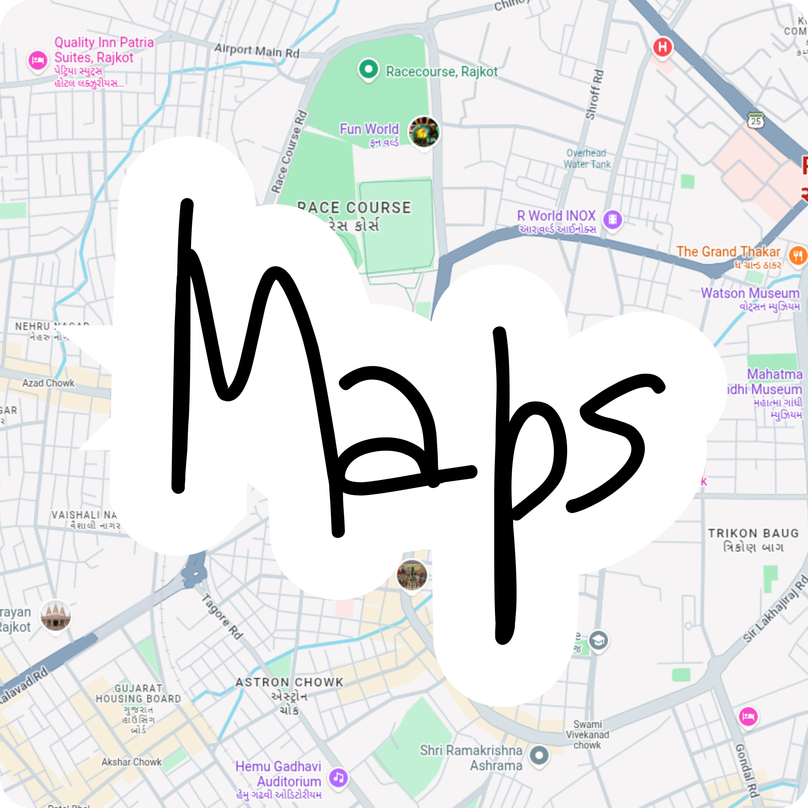

 

<h1> 𝘌𝘷𝘦𝘳𝘺𝘰𝘯𝘦 𝘰𝘯 𝘰𝘯𝘦 𝘮𝘢𝘱. 𝘕𝘰𝘣𝘰𝘥𝘺 𝘭𝘦𝘧𝘵 𝘣𝘦𝘩𝘪𝘯𝘥.

 

### ✨ About
MapTogether is for groups on the move. Whether everyone is traveling in different vehicles and trying to stay together or coming from different places to meet at one spot, you can see the whole group on one live map the entire time.

 

### 🚀 Features

| Feature | Description |
|---|---|
| 🗺️ **Live Group Map** | See every member of your group on one map in real time. |
| 🚗 **Convoy Mode** | Traveling together in different vehicles? See who's ahead, who's behind, who stopped. |
| 📍 **Meet at a Spot** | Everyone coming from different places? Pick a destination and watch everyone close in. |
| 👥 **Group Management** | Create a group or join one and manage who's in the trip. |

 

### 🐶 Say Hi !!, I dont bite

 

### 📸 Screenshots

 

